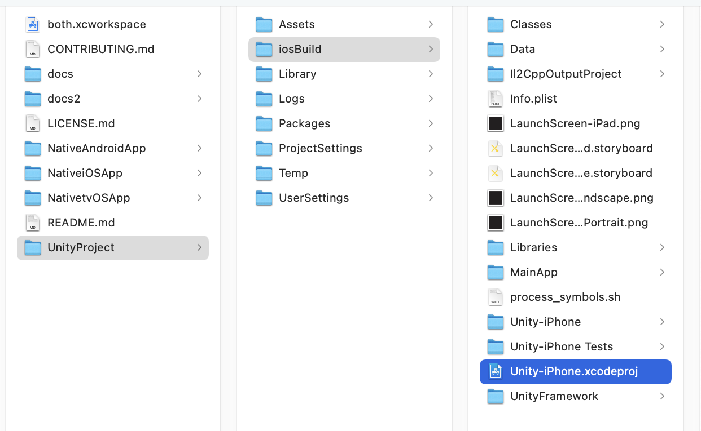
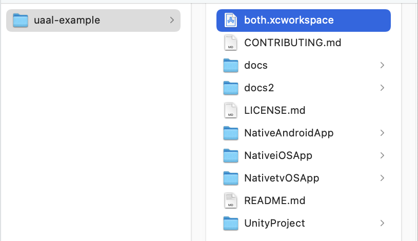
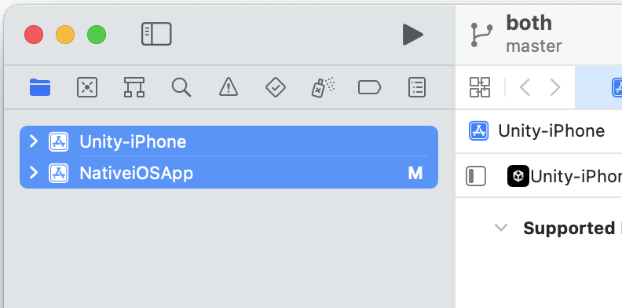

# Unity as a Libraryのサンプルプロジェクトを試す

## Unity as a Libraryとは
Unityを使った開発は通常、アプリ全体をUnityで開発しますが、Unity as a Libraryを使用すると、
XcodeやAndroid Studioで開発したネイティブアプリ内の一部のみをUnityで開発することができます。
なお、Unity as a Library は UaaL と略します。

## Swift版サンプルプロジェクト
https://github.com/Unity-Technologies/uaal-example  
元のリポジトリ内にあるiOSプロジェクトのコードはObjective-Cで書かれています。
そこで、Objective-Cのコードをswiftに書き直したものを作りました。  
https://github.com/rakusan/uaal-example  
以下では、このswift版の方を使用します。

なお、ここではiOSについてのみ触れAndroidについては触れません（自分はまだAndroidのUaaLについては把握できていません）

## サンプルプロジェクトを試す
https://github.com/rakusan/uaal-example/blob/master/docs/ios.md  
基本的にはここに書いてある通りの手順を踏めば試せます。以下はそれを日本語で要約したものです。

### 必要なもの
- Xcodeはできるだけ新しいものを使用してください（少し古いのでも大丈夫っぽいですが）
- Unityは2022.2.5f1を推奨します


### 1. プロジェクトの取得
```git clone https://github.com/rakusan/uaal-example.git```

### 2. Unityエディタでの操作
- Unityエディタで ```uaal-example/UnityProject``` を開く
- BundleID と Signing Team ID を設定
- プラットフォームをiOSに
- iosBuildフォルダ内にビルド（フォルダ名は何でもいいが）
  - Unity-iPhone.xcodeproj ができる
<br>

### 3. Xcodeワークスペースの作成
- 空のXcodeワークスペースを作成 (both.xcworkspace)
<br>
- NativeiOSApp.xcodeproj と Unity-iPhone.xcodeproj をワークスペースに追加
<br>

### 4. UnityFramework.framework を追加
- NativeiOSApp を選択
  - Generalタブの ```Frameworks, Libraries, and Embedded Content``` に ```Unity-iPhone/UnityFramework.framework``` を追加
  - Build Phasesの ```Link Binary With Libraries``` から ```UnityFramework.framework``` を削除

### 5. NativeCallProxy.h をパブリックにする
- ```Unity-iPhone/Libraries/Plugins/iOS/NativeCallProxy.h``` を選択
- Target Membership で UnityFramework を有効にし、Public に設定
<br>

### 6. Dataフォルダの Target Membership を UnityFramework に変更
（TODO: スクショ）

## ビルド
（TODO:スクショ）


## 実行時の画面の説明

### 初期画面
（TODO:画面のスクショ）  
これはSwiftのコードで書いたUI
（TODO:コードのスクショ）  

### initボタンを押すとUnityが起動
（TODO:スクショ）
- 背景と豆腐、黒地に白文字のボタンはUnity側で出している
- 緑・黄・赤のボタンはSwift側で出している

### その他のボタン
- ```Show Main```でUnityを非表示に → ```Show Unity```でUnityを表示
- ```Unload```でUnityをアンロード → 再度```init```でUnityを起動（初期状態から）
- ```Send Msg```でSwift側からUnity側にメッセージを送信
- ```Show Main with Color```でUnity側からSwift側にメッセージを送信
- ```Quit```Unityを完全に終了。以降、再度```init```は不可
